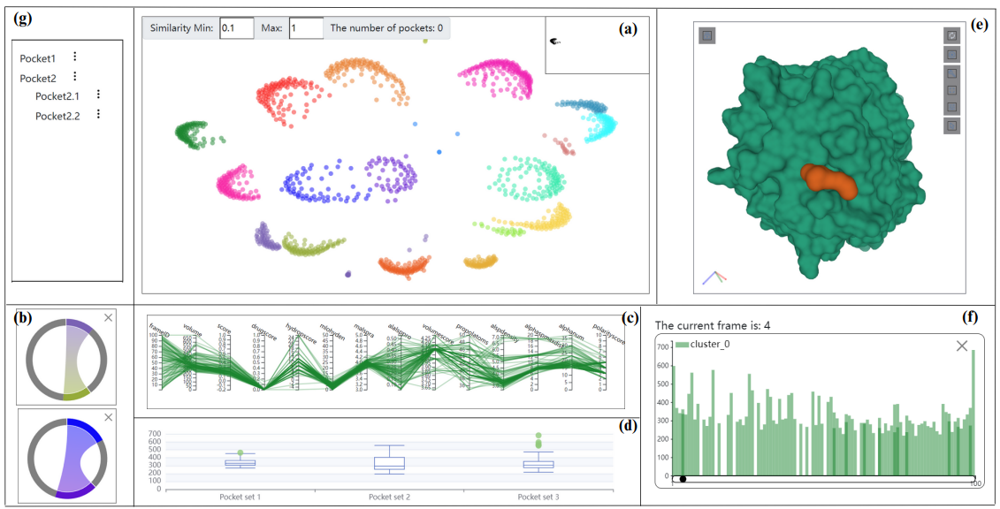

# pocketweb

## Project setup
```
npm install
```

### Compiles and hot-reloads for development
```
npm run serve
```

### Compiles and minifies for production
```
npm run build
```

## 概览图



**口袋动力学可视分析系统的抽象概述。口袋降维散点图（a）显示了口袋集的分布情况与大致关系。口袋关系弦图（b）用于对选中的口袋集进行比较，探索口袋集之间的相关性。口袋属性平行坐标图（c）用于展示选中的口袋集的相关物化性质变化情况，包括口袋体积、极性、亲疏水性。口袋属性盒图（d）用于展示相关属性的分布情况和离散情况。蛋白质三维结构视图（e）描述了分子和口袋的形态、位置和变化，有助于用户建立二维和三维之间的交互。属性柱状图（f）用于展示口袋的相关属性随时间的变化情况。辅助树状图（g）用于暂存口袋数据集，方便进行下一步的探索分析。**

## 背景意义

- 根据需求 可视化探索 所需要的口袋动力学，而不是直接将不同的口袋动力学直接展示出来，直接展示出的方法所过滤出的口袋是由算法预先设定的，不具有定制性

- 整个系统基于Jaccard相似性算法

- 使用Fpocket导出的每帧的口袋数据 是按照当前帧的口袋得分进行排序的，因此每帧口袋的同一个口袋序号（1-1，2-1，3-1）之间没有关系 。Fpocket可以识别DM模拟的每一帧的口袋，但是口袋的编号从一个快照到另一个快照发生变化，阻碍了对包动态的分析。

- 可视分析的最终目的：找到适合配体对接的口袋

  使用内壁原子（序列）进行计算相似性==>（TRAPP）使用结合位点残基也可以计算相似性

  

## 操作说明

- 初始化 蛋白质3维结构上包含所有的口袋

- 在点击某个散点 3维结构会更新为含有相应口袋的蛋白质结构

- ctrl 圈选/缩放

- shift 右上角小框 （`draggable="true"`）

- 弦图（`draggable="true"`） ——**相邻口袋探索**

- 拖动小框到+号位置 生成弦图 （弦图颜色由 出现的次数最多的颜色决定）

- 拖动两个口袋散点区域  单个弦所占区域与原子交集有关

- 拖动 小框/弦图 到左边栏 可改变颜色拖到左边栏的过程中会出现模态框。  

- 拖动 小框/弦图 到中下区域可绘制**平行坐标图** ——相似口袋 不同帧 属性变化

- 拖动 小框/弦图 到中下区域可绘制**盒图** ——口袋属性的离散程度与异常值

- 点击弦图（高亮对应散点、连线）、点击平行坐标图（高亮对应散点、连线、3D结构口袋）会根据设定的相似度显示对应的散点连线

- 拖动 小框/弦图 到右下角区域可绘制**柱状图**—— 相似口袋 体积或其他属性变化

  

## 探索过程

1. 圈选两块相近散点图——拖到弦图（相似度很高）——拖到柱状图——点击柱状图的小滑块（在3d结构中显示相应的口袋，发现是相邻口袋）——弦图拖到平行坐标图（两个口袋的属性变化的关联性） 

2. 为什么不能直接点击弦图 并在3d结构中展示相应口袋 ？因为圈选的散点可能属于很多不同的口袋，而柱状图展示的是某几个簇（某几个口袋）的帧_体积变化，一个簇代表的是一组 **帧—口袋** 对应数据（按帧进行分类）。小滑块对应柱状图的某一柱（帧），这一帧里可能会有几个不同的口袋  

   

## 修改建议


    1. 相似度原先只会选出大于某一个值的散点连线 ==>可以设置一个范围
    2. 右下角的柱状图变为双Y轴图 关于体积的柱状图、关于质心-阿尔法球的最大距离
    3. 柱状图的每条柱的颜色透明度与当前帧中口袋数量有关，如果圈选了相邻区域的一片散点，但是在柱状图的同一帧中出现了颜色加深的情况，说明在这一帧中出现了子口袋或者相邻口袋

 

## 最终的探索过程图示


口袋相关性探索过程。专家可以圈选感兴趣的口袋集，并将相应的缩略图拖动到弦图的位置来观察它们的相关性。口袋集的数据可以传递到平行坐标图中，进一步探索感兴趣的口袋，并验证它们之间的相关性。


口袋稳定性和连续性的探索过程。专家可以圈选散点图中感兴趣的口袋集，并将相应的缩略图拖动到盒图和平行坐标图的位置来观察它们的稳定性。通过体积柱状图，可以更清晰地观察出口袋的稳定性。专家可以基于口袋的稳定性进一步探索口袋的连续性。通过体积柱状图和蛋白质的三维结构视图的交互式探索，可以分析出口袋的连续性。


